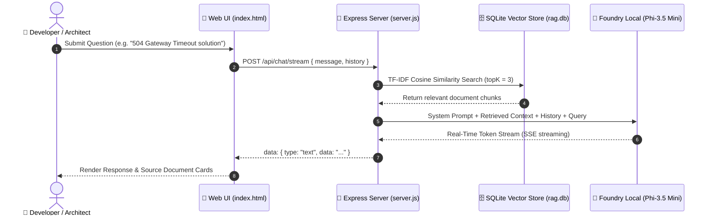

[](https://developer.mozilla.org/en-US/docs/Web/JavaScript)
[](https://nodejs.org/)
[](https://foundrylocal.ai)
[](https://huggingface.co/microsoft/Phi-3.5-mini-instruct)
[](LICENSE)
[]()

# 🌸 Software Architecture & API Troubleshooting Assistant – Local RAG
> **Software Architecture & API Troubleshooting Assistant (Local RAG)**

A fully offline (**100% Offline**), on-device (**On-Device AI**), **Retrieval-Augmented Generation (RAG)** based software architecture and API troubleshooting assistant.

Built with **[Foundry Local](https://foundrylocal.ai)** and **Phi-3.5 Mini Instruct**, this project provides a dedicated Senior Architecture Mentor right on your computer—with no internet connection, no cloud API keys, and no monthly subscription fees. The system grounds its answers exclusively in your indexed local knowledge base, eliminating hallucinations and ensuring safe fallback responses when insufficient context is found.


---

## ✨ Features (Key Features)

- 🔒 **100% Local Generation via Microsoft Foundry Local:** No data leaves your machine; runs completely offline on-device.
- 🧠 **Phi-3.5 Mini Instruct LLM:** High-reasoning and code generation Small Language Model (SLM) running locally.
- 🗄️ **SQLite + TF-IDF Cosine Similarity Search:** Lightweight, ultra-fast local search with no external vector database setup required.
- 🎓 **Empathetic Lead Architect Persona:** Explains underlying root causes, design patterns, and copyable production code examples instead of cold, robotic responses.
- 🎨 **Pink Pastel UI:** Soft pastel color palette (`#f472b6`, `#fbcfe8`, `#fb7185`), comfortable dark mode, and touch-friendly large buttons.
- ⚡ **API & Architecture Troubleshooting:** Step-by-step guidance for HTTP 502/504, 429 Rate Limits, CORS, OAuth2/JWT, Connection Pool leaks, Memory Leaks, Redis Cache Stampede, and Kafka DLQ.
- ⚡ **Real-Time SSE Response Streaming & Fallback:** Instant token-by-token streaming via Server-Sent Events with automated non-streaming fallback service.
- 📄 **Dynamic Document Ingestion (TXT / MD):** Drag-and-drop file upload from the web interface with runtime vector re-indexing.
- 🛡️ **Verifiable Sources & Similarity Score Display:** Surfaces expandable source references with match percentage score cards below every response.

---

## 🛠️ Architecture (Architecture)

```text
User Question 
       ↓
TF-IDF Cosine Similarity Search (SQLite)
       ↓
Relevant Context & Document Check
       ↓
Retrieved Context + System Prompts
       ↓
Foundry Local LLM (Phi-3.5 Mini)
       ↓
SSE Streaming / Non-Streaming Output
       ↓
Response + Verifiable Source Cards (% Match Score)
```

### Sequence Diagram



---

## 💻 Tech Stack

- **Language / Runtime:** JavaScript (ES2022), Node.js (≥ 20)
- **Web Server:** Express.js
- **Local AI Engine:** Microsoft Foundry Local SDK (`foundry-local-sdk`)
- **AI Model:** Phi-3.5 Mini Instruct (`phi-3.5-mini-instruct-generic-cpu`)
- **Local Vector Database:** SQLite3 (`better-sqlite3`) + TF-IDF Cosine Similarity
- **Web UI:** Single-Page HTML5 / CSS3 (Pink Pastel Theme, Markdown & Syntax Highlighting)
- **Testing Framework:** Node.js Native Test Runner (`node:test`)

---

## ⚙️ Current Settings

| Parameter | Current Value | Description |
|-----------|---------------|-------------|
| **Default LLM** | `phi-3.5-mini-instruct` (3.8B) | Stable on-device model with strong reasoning capabilities |
| **Vector Search Engine** | SQLite TF-IDF Cosine Similarity | Lightweight search requiring zero external embedding overhead |
| **Chunk Size** | ~200 tokens | Optimal context window allocation |
| **Chunk Overlap**| 25 tokens | Prevents abrupt sentence cuts across chunk boundaries |
| **Top K Chunks** | 3 Chunks | Maximum relevant context chunks fed to the LLM |
| **Conversation Memory**| Last 6 Messages | Conversation history limit to prevent context bloat |
| **Knowledge Base Size** | 10 Documents (~21 Chunks) | Architecture, API troubleshooting, and resilience guides |

---

## 📚 Knowledge Base Scope (Knowledge Base Docs)

The pre-indexed knowledge base covers 10 core software architecture and API troubleshooting manuals:

| Document | Topic Title | Scope |
|----------|-------------|-------|
| `01-api-error-codes-troubleshooting.md` | API Error Codes & Gateways | HTTP 4xx/5xx, 502 Bad Gateway, 504 Gateway Timeout, CORS and SSL/TLS Handshake |
| `02-microservices-resilience-patterns.md` | Microservices Resilience Patterns | Circuit Breaker, Exponential Backoff with Jitter, Bulkhead and Fallback strategies |
| `03-authentication-oauth2-jwt-troubleshooting.md` | Authentication & Security | OAuth2 Grant types (PKCE, Client Credentials), JWT validation, Token Refresh loops |
| `04-database-connection-pooling-performance.md` | Database Performance | Connection pool leaks (HikariCP/pg-pool), N+1 query problem, Deadlock management |
| `05-rate-limiting-throttling-strategies.md` | API Rate Limiting | Token Bucket, Leaky Bucket, Sliding Window and HTTP 429 Retry-After responses |
| `06-grpc-vs-rest-vs-graphql-architecture.md` | API Paradigms | Protobuf backward compatibility, GraphQL depth limits and REST OpenAPI |
| `07-memory-leaks-garbage-collection-debugging.md` | Memory Leak Diagnostics | Node.js / Java Heap Dump analysis, GC pause times and Event Loop lag |
| `08-caching-redis-strategies.md` | Caching & Redis Strategies | Cache Stampede (Thundering Herd), Cache Invalidation, Write-Through and Eviction policies |
| `09-message-queues-event-driven-architecture.md` | Message Queues & Event-Driven | Kafka/RabbitMQ Dead Letter Queue (DLQ), Idempotent Consumers and message ordering |
| `10-system-architecture-decision-tree.md` | Architecture Decision Trees | Root cause decision trees for high latency, cascading 5xx failures and memory spikes |

---

## 🖥️ Screenshots

|          Desktop UI     |
|-------------------------|
|           |

| Mentor Response & Code Example | Source Document Cards |
|--------------------------------|-----------------------|
|                  |                           |

|             Dynamic Document Upload             |
|-------------------------------------------------|
|                                   |

---

## 🚀 Setup & Usage

### 1. Prerequisites
- **Node.js** ≥ 20: [Download Node.js](https://nodejs.org/)
- **Foundry Local**: Microsoft's on-device AI runtime
  ```powershell
  winget install Microsoft.FoundryLocal
  ```

To verify:
```powershell
foundry --version
foundry model list
```

### 2. Installation
```bash
# Clone the repository
git clone https://github.com/YagmurInci/local-rag-agent.git
cd local-rag-agent

# Install dependencies
npm install
```

### 3. Document Ingestion
To index markdown `.md` or `.txt` files in `docs/` into the local vector store:

```bash
npm run ingest
```

### 4. Running the Server & Interface
```bash
npm run dev
# or for production
npm start
```
Open **http://127.0.0.1:3000** in your browser to start chatting with your mentor.

---

## 🧪 Unit & Integration Testing

The project includes 51 fully automated unit tests covering server routes, vector search, chunking, and system prompts:

```bash
npm test
```

**Test Output:**
```text
# tests 51
# suites 12
# pass 51
# fail 0
# duration_ms 580ms
```

---

## 🔌 API Endpoints

| Method | Endpoint | Description |
|--------|----------|-------------|
| `POST` | `/api/chat/stream` | Real-time SSE chat completion stream |
| `POST` | `/api/chat` | Standard non-streaming response |
| `POST` | `/api/upload` | Upload `.md` or `.txt` document and index dynamically |
| `GET` | `/api/docs` | Get list of indexed documents |
| `GET` | `/api/health` | Server and model health status check |

---

## 📁 Project Structure

```
LOCAL-RAG-AGENT/
├── docs/                     # 10 Software Architecture & API Troubleshooting Manuals
│   ├── 01-api-error-codes-troubleshooting.md
│   ├── 02-microservices-resilience-patterns.md
│   ├── 03-authentication-oauth2-jwt-troubleshooting.md
│   ├── ...
│   └── 10-system-architecture-decision-tree.md
├── public/
│   └── index.html            # Pink Pastel single-page responsive web UI
├── src/
│   ├── chatEngine.js         # Foundry Local SDK + RAG orchestrator
│   ├── chunker.js            # Document chunking & TF-IDF vector computation
│   ├── config.js             # Application configuration (model, paths, chunk sizes)
│   ├── ingest.js             # Document ingestion script
│   ├── prompts.js            # Senior Architect Mentor system prompts (Full & Dev/Edge mode)
│   ├── server.js             # Express server & API endpoints
│   └── vectorStore.js        # SQLite vector store manager
├── screenshots/              # Screenshots and architecture diagrams
├── test/                     # Automated unit test suite (Node.js test runner)
├── data/                     # Generated at runtime (SQLite database)
│   └── rag.db
├── package.json
└── README.md
```

---

## 🔒 Privacy & Security

- Built from the ground up on **On-Device AI principles**.
- Your documents are stored locally in SQLite; submitted questions and generated answers are **never sent** to external cloud servers or APIs.

---

## ⚠️ Model Limitations & Safety Disclaimer

- Local Small Language Models (Phi-3.5 Mini) run on resource-constrained hardware.
- For this reason, the system is designed to stay grounded in the local RAG knowledge base.

---

## ⚖️ Disclaimer

This application is created for general information and software education purposes. Architectural recommendations and code snippets should be reviewed and tested by your system engineering team before production deployment.

---

## 📜 License

This project is licensed under the [MIT License](LICENSE).
