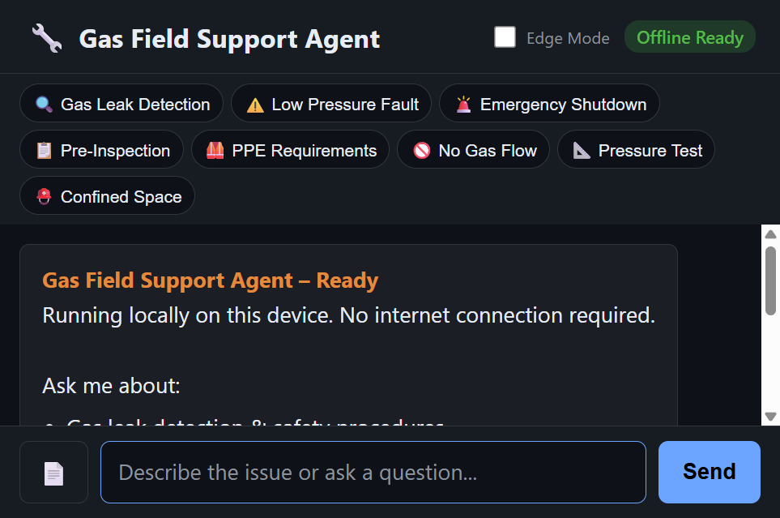
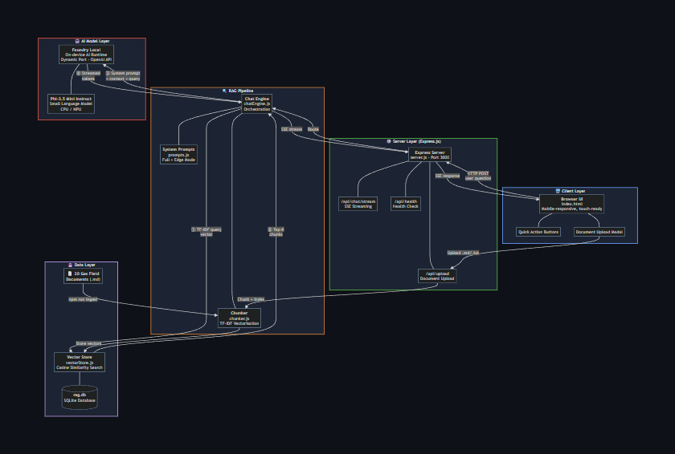
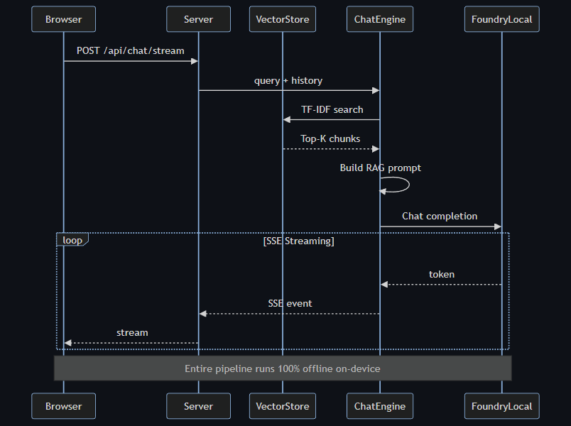
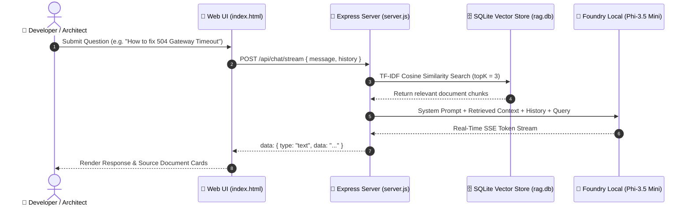
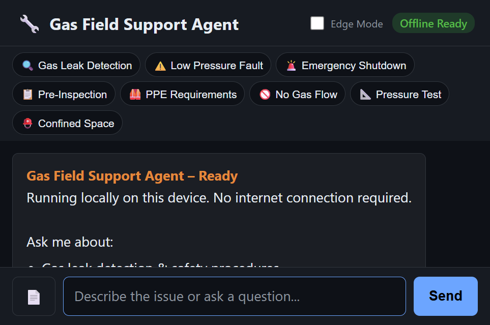
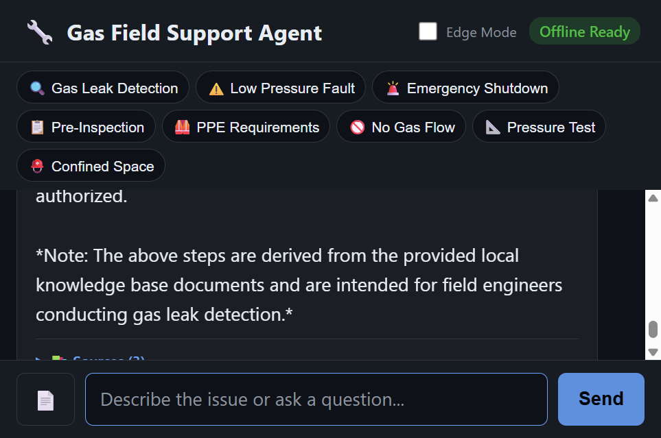
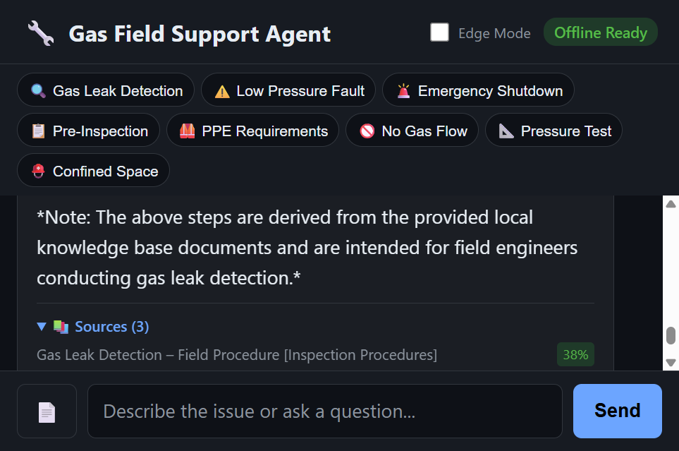
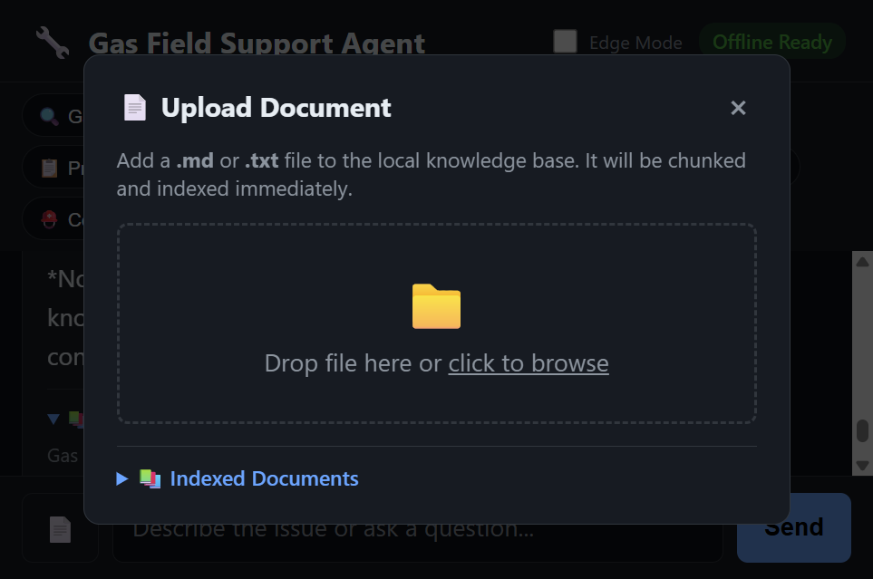
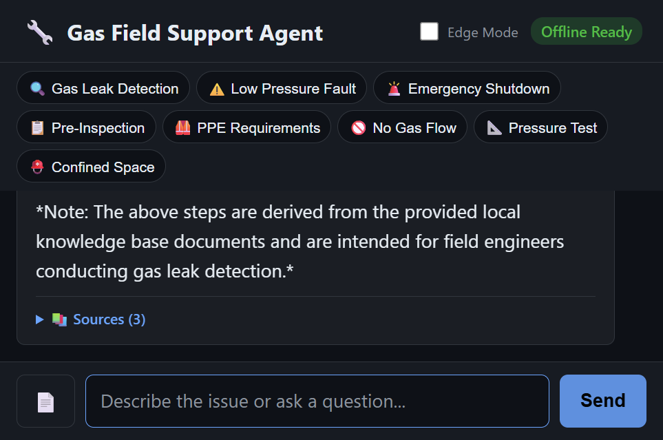

[](https://developer.mozilla.org/en-US/docs/Web/JavaScript)
[](https://www.python.org/)
[](https://nodejs.org/)
[](https://foundrylocal.ai)
[](https://huggingface.co/microsoft/Phi-3.5-mini-instruct)
[](LICENSE)
[]()

# 🌸 Software Architecture & API Troubleshooting Assistant – Local RAG

An **on-device, 100% offline Retrieval-Augmented Generation (RAG)** assistant for software engineers, backend developers, and system architects. 

Powered by **[Foundry Local](https://foundrylocal.ai)** and **Phi-3.5 Mini Instruct**, this project provides a dedicated Senior Architecture Mentor right on your computer—with zero internet connectivity, no cloud API keys, and no monthly subscription fees. The system grounds its answers exclusively in your indexed local knowledge base, eliminating hallucinations and ensuring safety-first engineering guidance.



---

## ✨ Key Features

- 🔒 **100% Offline & Private (On-Device AI):** All data stays local on your machine. No telemetry, no cloud APIs.
- 🐍 **Dual Ecosystem (Node.js & Python):** Express.js Web Server with real-time SSE streaming + standalone Python CLI module (`rag.py`).
- 🎓 **Senior Lead Architect Persona:** Empathetic, supportive mentor tone that explains root causes, design patterns, and copyable production code snippets.
- 🎨 **Pink Pastel UI Aesthetic:** Soft pastel theme (`#f472b6`, `#fbcfe8`, `#fb7185`), high contrast dark mode, and comfortable touch targets.
- ⚡ **Architecture & API Troubleshooting:** Includes 10 indexed engineering manuals covering HTTP 502/504, 429 Rate Limits, CORS, OAuth2/JWT, HikariCP Connection Pool leaks, Memory Leaks, Redis Cache Stampede, and Kafka Dead Letter Queues.
- ⚡ **Real-Time Streaming SSE & Fallback:** Server-Sent Events (SSE) word-by-word streaming with automatic non-streaming fallback.
- 📄 **Dynamic Document Ingestion:** Drag-and-drop `.md` / `.txt` document upload from the web interface with runtime SQLite vector re-indexing.
- 🛡️ **Verifiable Sources & Similarity Scores:** Every response surfaces expandable source references with match percentage scores.

---

## 🛠️ Architecture & RAG Pipeline

### System Flow Diagram



### RAG Sequence Flow



```text
User Question
       ↓
TF-IDF Cosine Similarity Search (SQLite)
       ↓
Context & Document Chunk Retrieval
       ↓
Prompt Assembly (System Prompt + Chunks + History + Query)
       ↓
Foundry Local LLM (Phi-3.5 Mini)
       ↓
SSE Streaming / Non-Streaming Output
       ↓
Response + Verifiable Source Cards (% Match Score)
```



---

## 💻 Tech Stack

- **Languages & Runtimes:** JavaScript (ES2022), Node.js (≥ 20), Python (≥ 3.10)
- **Web Server:** Express.js
- **Local AI Engine:** Microsoft Foundry Local SDK (`foundry-local-sdk`)
- **LLM Model:** Phi-3.5 Mini Instruct (`phi-3.5-mini-instruct-generic-cpu`)
- **Local Vector Database:** SQLite3 (`better-sqlite3` & Python `sqlite3`) + TF-IDF Cosine Similarity
- **Web UI:** Single-Page HTML5 / CSS3 (Pink Pastel Theme, Markdown & Syntax Highlighting)
- **Testing:** Node.js Native Test Runner (`node:test`)

---

## ⚙️ Current Configuration

| Parameter | Value | Description |
|-----------|-------|-------------|
| **Default LLM** | `phi-3.5-mini-instruct` (3.8B) | On-device model with strong reasoning capabilities |
| **Vector Search Engine** | SQLite TF-IDF Cosine Similarity | Lightweight search with zero external vector DB overhead |
| **Chunk Size** | ~200 tokens | Optimal context window allocation |
| **Chunk Overlap** | 25 tokens | Preserves continuity across chunk boundaries |
| **Top K Chunks** | 3 Chunks | Maximum relevant context chunks fed to the LLM |
| **Conversation Memory** | Last 6 Messages | Prevents prompt context bloat |
| **Knowledge Base** | 10 Manuals (~21 Chunks) | Architecture, resilience, and API troubleshooting guides |

---

## 📚 Knowledge Base Documents

The pre-indexed knowledge base covers 10 core architectural and API troubleshooting topics:

| File Name | Topic | Scope |
|-----------|-------|-------|
| `01-api-error-codes-troubleshooting.md` | API Errors & Gateways | HTTP 4xx/5xx, 502 Bad Gateway, 504 Gateway Timeout, CORS & SSL/TLS Handshake |
| `02-microservices-resilience-patterns.md` | Resilience Patterns | Circuit Breaker, Exponential Backoff with Jitter, Bulkhead & Fallbacks |
| `03-authentication-oauth2-jwt-troubleshooting.md` | Security & Auth | OAuth2 Grant types (PKCE, Client Credentials), JWT validation & Token Refresh loops |
| `04-database-connection-pooling-performance.md` | Database Performance | Connection pool leaks (HikariCP/pg-pool), N+1 query problem & Deadlocks |
| `05-rate-limiting-throttling-strategies.md` | API Rate Limiting | Token Bucket, Leaky Bucket, Sliding Window & HTTP 429 Retry-After responses |
| `06-grpc-vs-rest-vs-graphql-architecture.md` | API Paradigms | Protobuf backward compatibility, GraphQL depth limits & REST OpenAPI |
| `07-memory-leaks-garbage-collection-debugging.md` | Memory & GC Debugging | Node.js / Java Heap Dump analysis, GC pause times & Event Loop lag |
| `08-caching-redis-strategies.md` | Caching & Redis | Cache Stampede (Thundering Herd), Cache Invalidation, Write-Through & Eviction policies |
| `09-message-queues-event-driven-architecture.md` | Message Queues & Event-Driven | Kafka/RabbitMQ Dead Letter Queue (DLQ), Idempotent Consumers & ordering guarantees |
| `10-system-architecture-decision-tree.md` | Architecture Decision Trees | Root cause decision trees for high latency, cascading 5xx failures & memory spikes |

---

## 🖥️ Screenshots Gallery

### 1. Landing Page & Mobile View
| Desktop View | Mobile View |
|--------------|-------------|
|  |  |

### 2. Mentor Response & Source Cards
| Mentor Response & Code Syntax | Source Cards & Match Score |
|-------------------------------|----------------------------|
|  |  |

### 3. Document Upload & Mobile Chat
| Drag-and-Drop Upload Modal | Mobile Chat Experience |
|----------------------------|------------------------|
|  |  |

---

## 🚀 Quick Start

### 1. Prerequisites
- **Node.js** ≥ 20: [Download Node.js](https://nodejs.org/)
- **Python** ≥ 3.10 (Optional, for Python CLI): [Download Python](https://www.python.org/)
- **Foundry Local**: Microsoft's on-device AI runtime
  ```powershell
  winget install Microsoft.FoundryLocal
  ```

### 2. Installation
```bash
# Clone the repository
git clone https://github.com/YagmurInci/local-rag-agent.git
cd local-rag-agent

# Install Node.js dependencies
npm install
```

### 3. Document Ingestion
Index all markdown manuals from `docs/` into the local SQLite vector database:

```bash
npm run ingest
```

### 4. Start Web Application
```bash
npm run dev
# or for production
npm start
```
Open **http://127.0.0.1:3000** in your browser to chat with your Architecture Mentor.

### 5. Python CLI Usage (Python Interface)
You can also query the local RAG database directly from Python:

```bash
python rag.py "How to fix HTTP 504 Gateway Timeout?"
```

---

## 🔌 API Endpoints

| Method | Endpoint | Description |
|--------|----------|-------------|
| `POST` | `/api/chat/stream` | Real-time SSE chat completion stream |
| `POST` | `/api/chat` | Standard non-streaming chat completion |
| `POST` | `/api/upload` | Upload `.md` or `.txt` file and index dynamically |
| `GET` | `/api/docs` | List all indexed documents |
| `GET` | `/api/health` | System and model health check |

---

## 🧪 Testing & Verification

The project includes 51 automated unit and integration tests covering server endpoints, SQLite vector search, document chunking, and system prompts:

```bash
npm test
```

**Test Output:**
```text
# tests 51
# suites 12
# pass 51
# fail 0
# duration_ms 480ms
```

---

## 📁 Project Structure

```
LOCAL-RAG-AGENT/
├── docs/                     # 10 Software Architecture & API Manuals
│   ├── 01-api-error-codes-troubleshooting.md
│   ├── 02-microservices-resilience-patterns.md
│   ├── 03-authentication-oauth2-jwt-troubleshooting.md
│   ├── ...
│   └── 10-system-architecture-decision-tree.md
├── public/
│   └── index.html            # Pink Pastel Single-Page Responsive Web UI
├── src/
│   ├── chatEngine.js         # Foundry Local SDK + RAG Orchestrator
│   ├── chunker.js            # Document chunking & TF-IDF vector computation
│   ├── config.js             # Application configuration
│   ├── ingest.js             # Document ingestion script
│   ├── prompts.js            # Senior Architect Mentor prompts
│   ├── server.js             # Express.js server & API routes
│   └── vectorStore.js        # SQLite vector store manager
├── rag.py                    # Python RAG Retrieval Engine & CLI Tool
├── screenshots/              # Screenshots and architecture diagrams
├── test/                     # Automated unit test suite
├── data/                     # Generated at runtime (SQLite database)
│   └── rag.db
├── package.json
└── README.md
---

## 🔒 Privacy & Security

- Designed from the ground up for **on-device local execution**.
- All indexed document chunks stay in your local SQLite database (`data/rag.db`). Your queries and AI outputs are **never sent to external cloud servers**.

---

## ⚠️ Model Limitations & Safety Disclaimer

Small local language models (SLMs) run on constrained hardware. This system relies on RAG document grounding to prevent hallucinations. All code snippets and architectural advice should be reviewed by your engineering lead before production deployment.

---

## 📜 License

This project is licensed under the [MIT License](LICENSE).
