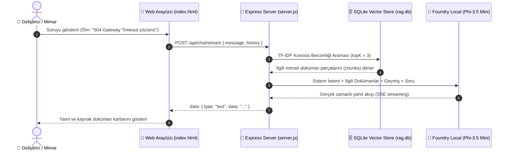

[](https://developer.mozilla.org/en-US/docs/Web/JavaScript)
[](https://nodejs.org/)
[](https://foundrylocal.ai)
[](https://huggingface.co/microsoft/Phi-3.5-mini-instruct)
[](LICENSE)
[]()

# 🌸 Mimari Danışman Mentor – Yazılım Mimarisi & API Sorun Giderme Asistanı
> **Software Architecture & API Troubleshooting Assistant (Local RAG)**

Tamamen çevrimdışı (**100% Offline**), cihaz üzerinde çalışan (**On-Device AI**), **Retrieval-Augmented Generation (RAG)** tabanlı yazılım mimarisi ve API hata giderme asistanı. 

**[Foundry Local](https://foundrylocal.ai)** ve **Phi-3.5 Mini Instruct** modeli ile geliştirilen bu proje; internet bağlantısı, bulut API anahtarı veya abonelik ücreti olmadan cihazınız üzerinde çalışan birebir kıdemli mimarlık mentoru sunar. Sistem yalnızca yerel bilgi tabanından getirilen kaynakları kullanır; yeterli kaynak bulunmadığında uydurma (hallucination) yapmaz ve güvenli fallback yanıtları üretir.


---

## ✨ Özellikler (Key Features)

- 🔒 **Microsoft Foundry Local ile Tamamen Yerel Üretim:** Hiçbir veri dışarı çıkmaz, 100% çevrimdışı cihaz üzerinde çalışır.
- 🧠 **Phi-3.5 Mini Instruct LLM:** Cihaz içi yüksek mantık ve kod üretme yetenekli küçük dil modeli (SLM).
- 🗄️ **SQLite + TF-IDF Kosinüs Benzerliği Araması:** Harici vektör veritabanı kurulumu gerektirmeyen, hafif ve ultra hızlı yerel arama.
- 🎓 **Samimi Mentor Personası (Friendly Lead Architect):** Kuru ve robotik cevaplar yerine konuların altında yatan kök nedenleri, mimari kalıpları ve kopyalanabilir kod örneklerini açıklar.
- 🎨 **Pembe Pastel UI:** Yumuşak pastel tonları (`#f472b6`, `#fbcfe8`, `#fb7185`), göz yormayan karanlık tema ve dokunmatik uyumlu büyük butonlar.
- ⚡ **API & Mimari Sorun Giderme:** HTTP 502/504, 429 Rate Limit, CORS, OAuth2/JWT, Connection Pool sızıntıları, Memory Leak, Redis Cache Stampede ve Kafka DLQ kılavuzluğu.
- ⚡ **Gerçek Zamanlı SSE Yanıt Akışı & Fallback:** Server-Sent Events ile anında kelime kelime yanıt üretimi ve otomatik non-streaming yedekleme servisi.
- 📄 **Dinamik Doküman Yükleme (TXT / MD Ingestion):** Arayüzden sürükle-bırak ile yeni mimari doküman yükleme ve çalışma zamanında anında indeksleme.
- 🛡️ **Kaynak ve Benzerlik Skoru Gösterimi:** Üretilen her yanıtın altına doğrulanabilir kaynak doküman adları ve benzerlik skoru kartlarının eklenmesi.

---

## 🛠️ Mimari (Architecture)

```text
Kullanıcı Sorusu 
       ↓
TF-IDF Kosinüs Benzerliği Araması (SQLite)
       ↓
İlgili Kaynak & Bağlam Kontrolü
       ↓
Kaynaklı Context + Sistem İstemı (Prompts)
       ↓
Foundry Local LLM (Phi-3.5 Mini)
       ↓
SSE Streaming / Non-Streaming Yanıt
       ↓
Cevap + Doğrulanabilir Kaynak Kartları (% Benzerlik Skoru)
```

### Akış Şeması (Sequence Diagram)



---

## 💻 Teknoloji Yığını (Tech Stack)

- **Dil / Çalışma Zamanı:** JavaScript (ES2022), Node.js (≥ 20)
- **Sunucu / Web Çatısı:** Express.js
- **Yerel AI Motoru:** Microsoft Foundry Local SDK (`foundry-local-sdk`)
- **Yapay Zeka Modeli:** Phi-3.5 Mini Instruct (`phi-3.5-mini-instruct-generic-cpu`)
- **Yerel Vektör Veritabanı:** SQLite3 (`better-sqlite3`) + TF-IDF Kosinüs Benzerliği
- **Arayüz:** Single-Page HTML5 / CSS3 (Pink Pastel Theme, Markdown & Syntax Highlighting)
- **Test Çatısı:** Node.js Native Test Runner (`node:test`)

---

## ⚙️ Güncel Ayarlar (Current Settings)

| Parametre | Güncel Değer | Açıklama |
|-----------|--------------|----------|
| **Varsayılan LLM** | `phi-3.5-mini-instruct` (3.8B) | Cihaz üzerinde çalışan kararlı ve yüksek mantık yetenekli model |
| **Vektör Arama Motoru** | SQLite TF-IDF Cosine Similarity | Cihaz üzerinde ekstra embedding yükü gerektirmeyen hafif arama |
| **Chunk Boyutu (Chunk Size)** | ~200 tokens | Optimal bağlam yakalama ve hızlı arama aralığı |
| **Chunk Örtüşmesi (Chunk Overlap)**| 25 tokens | Bağlantılı cümlelerin kesilmesini önleyen örtüşme |
| **Top K (En İyi Parça)** | 3 Chunks | Modele beslenen en yüksek alakalı kaynak sayısı |
| **Sohbet Derinliği (History Limit)**| Son 6 Mesaj | Bağlam şişmesini önleyen sohbet bellek sınırı |
| **Bilgi Tabanı Boyutu** | 10 Doküman (~21 İndekslenmiş Chunks) | Mimarlık, API sorun giderme ve dayanıklılık kılavuzları |

---

## 📚 Bilgi Tabanı Kapsamı (Knowledge Base Docs)

Projede varsayılan olarak indekslenmiş 10 temel yazılım mimarisi ve API hata giderme kılavuzu yer almaktadır:

| Doküman | Konu Başlığı | Kapsam |
|---------|--------------|--------|
| `01-api-error-codes-troubleshooting.md` | API Hata Kodları & Gateway | HTTP 4xx/5xx, 502 Bad Gateway, 504 Gateway Timeout, CORS ve SSL/TLS Handshake |
| `02-microservices-resilience-patterns.md` | Mikroservis Dayanıklılık Kalıpları | Circuit Breaker, Exponential Backoff with Jitter, Bulkhead ve Fallback stratejileri |
| `03-authentication-oauth2-jwt-troubleshooting.md` | Kimlik Doğrulama & Güvenlik | OAuth2 Grant Tipleri (PKCE, Client Credentials), JWT Doğrulama, Token Refresh döngüleri |
| `04-database-connection-pooling-performance.md` | Veritabanı Performansı | Connection Pool sızıntıları (HikariCP/pg-pool), N+1 problemi, Deadlock yönetimi |
| `05-rate-limiting-throttling-strategies.md` | API Rate Limiting | Token Bucket, Leaky Bucket, Sliding Window ve HTTP 429 Retry-After yanıtları |
| `06-grpc-vs-rest-vs-graphql-architecture.md` | API Paradigmaları | Protobuf geriye dönük uyumluluk kuralları, GraphQL derinlik sınırı ve REST OpenAPI |
| `07-memory-leaks-garbage-collection-debugging.md` | Bellek Sızıntısı Teşhisi | Node.js / Java Heap Dump analizi, GC pause süreleri ve Event Loop lag tespiti |
| `08-caching-redis-strategies.md` | Önbellek & Redis Stratejileri | Cache Stampede (Thundering Herd), Cache Invalidation, Write-Through ve Eviction politikaları |
| `09-message-queues-event-driven-architecture.md` | Mesaj Kuyrukları & Olay Odaklı Mimari | Kafka/RabbitMQ Dead Letter Queue (DLQ), Idempotent Consumer ve mesaj sırası garantileri |
| `10-system-architecture-decision-tree.md` | Mimari Karar Ağaçları | Yüksek API gecikmesi, zincirleme 5xx hataları ve bellek sıçramaları için kök neden karar ağacı |

---

## 🖥️ Arayüz Görüntüleri (Screenshots)

| Masaüstü Arayüzü (Desktop) | Mobil Görünüm (Mobile) |
|----------------------------|------------------------|
|  |  |

| Mentor Yanıtı & Kod Örneği | Kaynak Doküman Kartları |
|----------------------------|-------------------------|
|  |  |

| Dinamik Doküman Yükleme | Mobil Sohbet Deneyimi |
|-------------------------|-----------------------|
|  |  |

---

## 🚀 Kurulum & Çalıştırma (Setup & Usage)

### 1. Gereksinimler (Prerequisites)
- **Node.js** ≥ 20: [İndirmek için tıklayın](https://nodejs.org/)
- **Foundry Local**: Microsoft'un cihaz üzerinde çalışan yapay zeka çalışma zamanı
  ```powershell
  winget install Microsoft.FoundryLocal
  ```

Kontrol etmek için:
```powershell
foundry --version
foundry model list
```

### 2. Kurulum
```bash
# Projeyi klonlayın
git clone https://github.com/YagmurInci/local-rag-agent.git
cd local-rag-agent

# Bağımlılıkları yükleyin
npm install
```

### 3. Bilgi Tabanını İndeksleme (Ingestion)
`docs/` klasörüne eklenen yeni metin `.md` veya `.txt` dosyalarını veritabanına indekslemek için:

```bash
npm run ingest
```

### 4. Sunucuyu ve Arayüzü Başlatma
```bash
npm run dev
# veya prodüksiyon için
npm start
```
Tarayıcınızda **http://127.0.0.1:3000** adresini açarak mentörünüz ile sohbet etmeye başlayabilirsiniz.

---

## 🧪 Birim & Entegrasyon Testleri (Testing)

Projede sunucu rotaları, vektör arama, doküman parçalama ve sistem istemlerini kapsayan 51 adet bütünüyle otomatik birim testi bulunmaktadır:

```bash
npm test
```

**Test Çıktısı:**
```text
# tests 51
# suites 12
# pass 51
# fail 0
# duration_ms 580ms
```

---

## 🔌 API Uç Noktaları (API Endpoints)

| Metot | Uç Nokta | Açıklama |
|-------|----------|----------|
| `POST` | `/api/chat/stream` | Gerçek zamanlı SSE yanıt akışı |
| `POST` | `/api/chat` | Standart yanıt (non-streaming) |
| `POST` | `/api/upload` | Yeni `.md` veya `.txt` doküman yükleme ve indeksleme |
| `GET` | `/api/docs` | İndekslenmiş doküman listesini alma |
| `GET` | `/api/health` | Sunucu ve model sağlık durumu kontrolü |

---

## 📁 Proje Dizin Yapısı (Project Structure)

```
LOCAL-RAG-AGENT/
├── docs/                     # 10 Adet Yazılım Mimarisi & API Hata Giderme Kılavuzu
│   ├── 01-api-error-codes-troubleshooting.md
│   ├── 02-microservices-resilience-patterns.md
│   ├── 03-authentication-oauth2-jwt-troubleshooting.md
│   ├── ...
│   └── 10-system-architecture-decision-tree.md
├── public/
│   └── index.html            # Pembe Pastel temalı, duyarlı (responsive) web UI
├── src/
│   ├── chatEngine.js         # Foundry Local SDK + RAG orkestrasyonu
│   ├── chunker.js            # Doküman parçalama & TF-IDF vektör hesaplama
│   ├── config.js             # Uygulama yapılandırması (model, yollar, chunk boyutları)
│   ├── ingest.js             # Doküman indeksleme betiği
│   ├── prompts.js            # Samimi Mentor sistem istemleri (Full & Dev/Edge mod)
│   ├── server.js             # Express sunucusu & API uç noktaları
│   └── vectorStore.js        # SQLite tabanlı yerel vektör deposu
├── screenshots/              # Ekran görüntüleri ve mimari diyagramlar
├── test/                     # Node.js test runner ile yazılmış birim testler
├── data/                     # Çalışma zamanında oluşturulan SQLite DB (rag.db)
├── package.json
└── README.md
```

---

## 🔒 Gizlilik & Veri Güvenliği (Privacy & Security)

- Proje tamamen **yerel çalışma prensibine (On-Device AI)** göre geliştirilmiştir.
- Dokümanlarınız cihazınızdaki SQLite veritabanında saklanır; girdiğiniz sorular ve üretilen yanıtlar hiçbir bulut sunucusuna veya dış API'ye **gönderilmez**.

---

## ⚠️ Model Sınırlamaları & Güvenlik Uyarısı

- Yerel küçük dil modelleri (Phi-3.5 Mini), yüz milyarlarca parametreli dev bulut modellerine kıyasla kaynak kısıtlı donanımlarda çalışır.
- Bu nedenle sistem, yerel RAG veritabanındaki dokümanlara bağlı kalacak şekilde tasarlanmıştır.

---

## ⚖️ Sorumluluk Reddi (Disclaimer)

Bu uygulama genel bilgilendirme ve yazılım eğitimi amacıyla geliştirilmiştir. Sunulan mimari öneriler ve kod örnekleri prodüksiyon ortamına alınmadan önce ilgili sistem mühendisliği ekibi tarafından incelenmeli ve test edilmelidir.

---

## 📜 Lisans (License)

Bu proje [MIT Lisansı](LICENSE) altında lisanslanmıştır.


1. YAML front-matter (title, category, id) is stripped and stored as metadata
2. The body text is tokenized by whitespace
3. A sliding window walks through the tokens, emitting one chunk per step
4. Each new window starts 25 tokens before the previous one ended, creating overlap
5. Documents shorter than 200 tokens are kept as a single chunk

### Why Fixed-Size Sliding Window?

| Design constraint | How fixed-size chunking helps |
|---|---|
| **Small local model (Phi-3.5 Mini)** | 200-token chunks keep retrieved context compact, leaving room in the model's context window for the system prompt, conversation, and generated output |
| **NPU/CPU execution** | No embedding model needed for chunking: just string operations. All compute budget stays with the LLM |
| **Zero dependencies** | No tokenizer library, no embedding runtime, no vector database. Chunking is pure JavaScript |
| **Predictable memory** | Every chunk is roughly the same size, so retrieval cost and context usage are consistent and predictable |

### Why Not Other Strategies?

| Alternative | Trade-off |
|---|---|
| **Sentence-based** | Chunk sizes vary unpredictably; some safety procedures are single long sentences that wouldn't split well |
| **Section-aware** (split on `##` headings) | Section lengths vary widely across the 20 docs: some would be too small (wasting retrieval slots), others too large for the model's context window |
| **Recursive** (LangChain-style) | Better boundary handling, but adds complexity and dependencies for marginal gain on short documents |
| **Semantic** (embedding-based topic detection) | Best retrieval quality, but requires a second model in memory alongside Phi-3.5 Mini: risky on constrained NPU/CPU hardware with 8–16 GB shared memory |

### Performance Benefits

**For the system:**
- **~1ms retrieval**: TF-cosine similarity over fixed-size chunks is near-instant, compared to ~100–500ms if an embedding model had to encode each query
- **Fast ingestion**: all 20 documents are chunked and indexed in under a second; no embedding computation required
- **Single model in memory**: no embedding model competing with the LLM for limited NPU/RAM resources
- **Minimal storage**: chunks stored as plain text in SQLite with lightweight TF-IDF vectors; no high-dimensional embedding arrays

**For the end user:**
- **Instant search results**: the retrieval step adds negligible latency, so the user only waits for the LLM to generate
- **Higher-quality generation**: compact 200-token chunks mean the model receives focused, relevant context rather than large noisy blocks
- **Consistent response times**: uniform chunk sizes mean retrieval and generation latency is predictable regardless of which documents are matched
- **Works on modest hardware**: the lightweight pipeline runs on laptops and field devices without a dedicated GPU

### When to Consider Switching

If you adapt this project for larger or more complex document sets, consider upgrading the chunking strategy:

- **Hundreds of long documents** → recursive or section-aware chunking to better respect document structure
- **Embedding-based retrieval** → semantic chunking becomes worthwhile when paired with vector similarity search
- **Mixed content types** (tables, code, prose) → format-aware chunking to keep logical units intact
- **Higher precision requirements** → sentence-level chunking to avoid partial-match noise

For the current use case: 20 short procedural guides on constrained local hardware: fixed-size sliding window delivers the best balance of simplicity, speed, and retrieval quality.

## API Endpoints

| Method | Endpoint | Description |
|--------|----------|-------------|
| `POST` | `/api/chat` | Non-streaming chat completion |
| `POST` | `/api/chat/stream` | Streaming chat via SSE |
| `POST` | `/api/upload` | Upload a document to the knowledge base |
| `GET` | `/api/docs` | List indexed documents |
| `GET` | `/api/health` | Health check |

## RAG Document Categories

The 20 included documents cover:

| # | Category | Documents |
|---|----------|-----------|
| 1 | Safety & Compliance | Emergency shutdown, PPE, confined space, hot work permits |
| 2 | Inspection Procedures | Leak detection, pressure testing, valve inspection, pipeline integrity, pre-inspection checklist |
| 3 | Fault Diagnosis | Regulator faults, gas detector fault codes, no-gas-flow decision tree |
| 4 | Repair & Maintenance | Gasket replacement, cathodic protection, corrosion treatment, purging |
| 5 | Equipment Manuals | Compressor maintenance, sensor calibration, relief valve testing, meter installation |

## Edge / Compact Mode

Toggle **Edge Mode** in the UI header for constrained devices:

| Setting | Full Mode | Edge Mode |
|---------|-----------|-----------|
| System prompt | ~300 tokens | ~80 tokens |
| Max output tokens | 1024 | 512 |
| Retrieved chunks | 5 | 3 |

## Key Concepts for New Developers

### What is Foundry Local?

[Foundry Local](https://foundrylocal.ai) is Microsoft's on-device AI runtime. It lets you run small language models (SLMs) like Phi-3.5 Mini directly on your laptop or workstation, with no GPU required and no cloud dependency. The SDK manages model discovery, downloading, loading, and inference entirely programmatically.

```js
import { FoundryLocalManager } from "foundry-local-sdk";

// Create the manager and discover models via the catalog
const manager = FoundryLocalManager.create();
const model = manager.catalog.getModel("phi-3.5-mini");
await model.load();

// Create a chat client and start generating
const chatClient = model.createChatClient();
const response = await chatClient.completeChat([
  { role: "user", content: "How do I detect a gas leak?" }
]);
console.log(response.choices[0].message.content);
```

### What is TF-IDF?

TF-IDF (Term Frequency–Inverse Document Frequency) is a classic information retrieval technique. Each document chunk is converted into a numeric vector based on how important each word is within that chunk relative to all chunks. At query time, the user's question is vectorized the same way and compared against all stored vectors using cosine similarity.

This project uses TF-IDF instead of embedding models to keep everything lightweight and offline: no embedding API or large model needed for retrieval.

### Why SQLite for Vectors?

For small-to-medium document collections (hundreds to low thousands of chunks), SQLite is fast enough for brute-force cosine similarity search and adds zero infrastructure. No need for Pinecone, Qdrant, or Chroma: just a single `.db` file on disk.

## Running Tests

```bash
npm test
```

Tests use the built-in Node.js test runner (no extra dependencies). They cover the chunker, vector store, config, and server endpoints.

## Scripts

| Script | Command | Description |
|--------|---------|-------------|
| Ingest | `npm run ingest` | Chunk and index all docs into SQLite |
| Start | `npm start` | Start the server (production) |
| Dev | `npm run dev` | Start with auto-restart on file changes |
| Test | `npm test` | Run unit tests |

## Adapting This for Your Own Use Case

This project is a scenario sample: you can fork it and adapt it to any domain:

1. **Replace the documents** in `docs/` with your own `.md` files (product manuals, internal wikis, support articles)
2. **Edit the system prompt** in `src/prompts.js` to match your domain and tone
3. **Adjust chunk sizes** in `src/config.js`: smaller chunks for precise retrieval, larger for more context
4. **Swap the model** in `src/config.js` to any model available in the Foundry Local catalog
5. **Customise the UI**: the frontend is a single HTML file with inline CSS, easy to modify

## License

MIT – This solution is a scenario sample for learning and experimentation.
